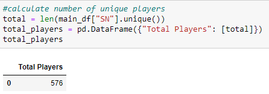
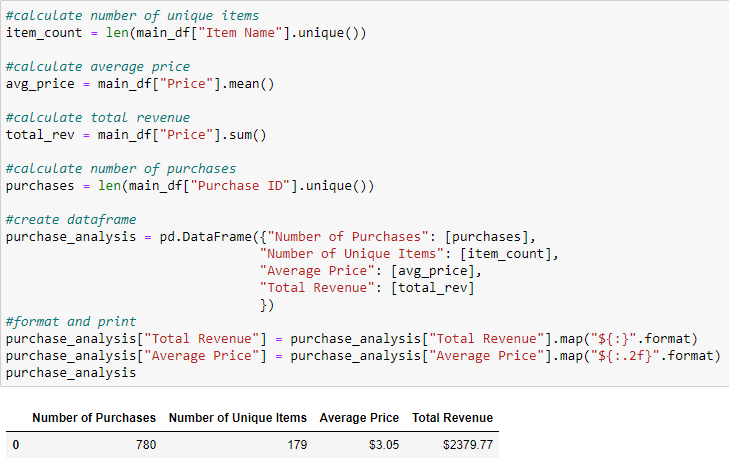
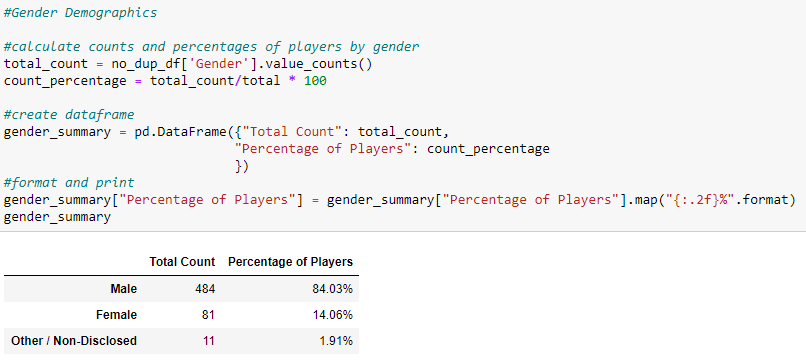
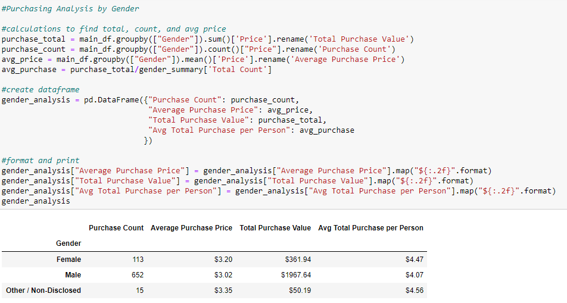
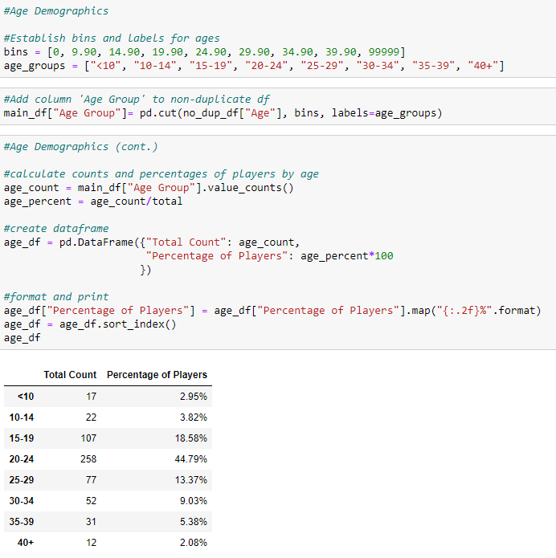
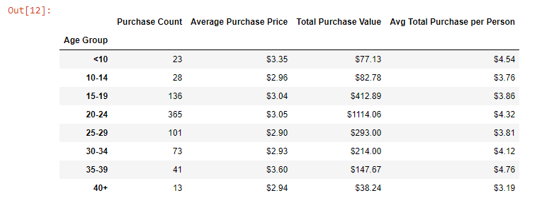
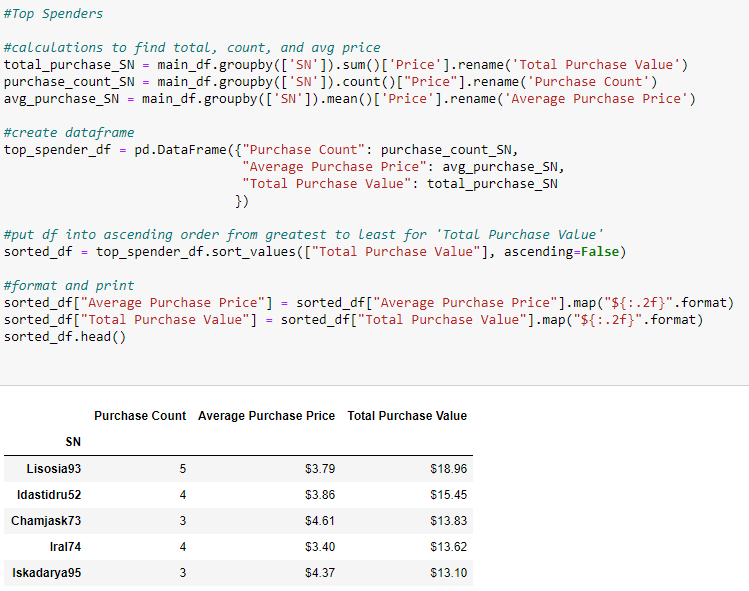
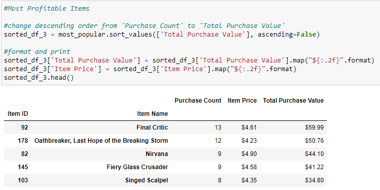

# Heros of Pymoli

## Background

In this project, I was tasked with generating a report that breaks down a free (fictional) mobile game's optional purchasing data, [in CSV format](https://nu.bootcampcontent.com/NU-Coding-Bootcamp/nu-chi-data-pt-11-2020-u-c/blob/master/Homework/04-Pandas/Instructions/HeroesOfPymoli/Resources/purchase_data.csv), into meaningful insights.

## The Report Incudes the Following:

### Player Count
* Total Number of Players

### Purchasing Analysis
* Number of Unique Items
* Average Purchase Price
* Total Number of Purchases
* Total Revenue

### Gender Demographics
* Percentage and Count of Male Players
* Percentage and Count of Female Players
* Percentage and Count of Other / Non-Disclosed

### Purchasing Analysis (Gender)
* Purchase Count
* Average Purchase Price
* Total Purchase Value
* Average Purchase Total per Person by Gender

### Age Demographics
* Purchase Count
* Average Purchase Price
* Total Purchase Value
* Average Purchase Total per Person by Age Group

### Top Spenders

* Identify the the top 5 spenders in the game by total purchase value, then list (in a table):
  * SN
  * Purchase Count
  * Average Purchase Price
  * Total Purchase Value

### Most Popular Items

* Identify the 5 most popular items by purchase count, then list (in a table):
  * Item ID
  * Item Name
  * Purchase Count
  * Item Price
  * Total Purchase Value

### Most Profitable Items

* Identify the 5 most profitable items by total purchase value, then list (in a table):
  * Item ID
  * Item Name
  * Purchase Count
  * Item Price
  * Total Purchase Value

## Observations

1. The company's revenue driving demographic is males, ages 20-24
    
2. The majority of gamers appear to only make small, one-time purchases, although the range of time in which this data was collected is   unclear.
    
3. The majority of revenue is generated by a handful of popular items, such as, 'Final Critic' and 'Oathbreaker,' 'Last Hope of Breaking the Storm'